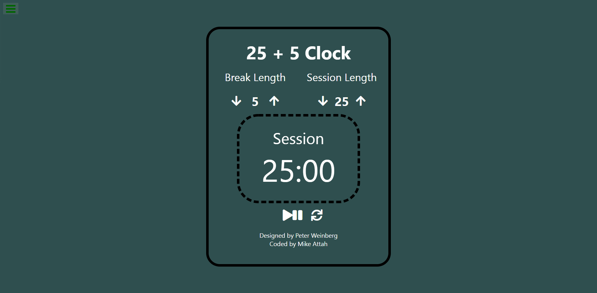

# FCC 25 + 5 Clock Project

## Front End Development Libraries Certification

This project was bootstrapped with [Create React App](https://github.com/facebook/create-react-app). The app is a simple stop clock for controlling sessions and breaks in say, a meeting.

You can view it on Code Pen: [https://codepen.io/mikeattah/pen/dyWaqxx](https://codepen.io/mikeattah/pen/dyWaqxx).

## Screenshot

## Key Tools and Methods

- Git/GitHub
- HTML
- CSS
  - Flexbox
- JavaScript
  - Ternary Operator
  - ES6
  - Template Literals
- React.js
  - useState
  - useEffect
